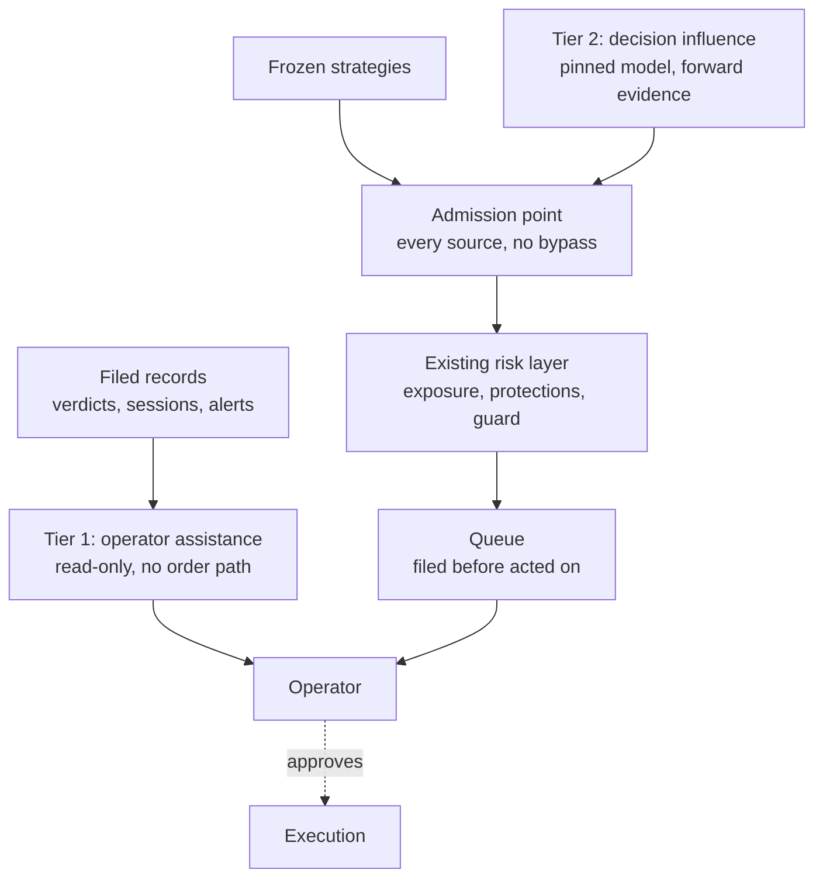

# Draft: assisted decisions, and where a model may and may not act

**Status: working draft, first pass 2026-09-09. Not governance.** The
[charter](CHARTER.md), the [playbook](playbook/README.md) and the ADRs decide things; this
file does not. It exists to be argued with, the same way
[`DRAFT_OPERATOR_DAY.md`](DRAFT_OPERATOR_DAY.md) does, and its job is to answer a question
the other documents have never been asked: **what may a language model do in a system that
risks money, and what may it never do?**

Additive. No existing strategy logic, gate, or mode rule changes. Nothing here supersedes
an ADR.

Descends from an owner proposal of 2026-09-09. What changed in this pass is recorded under
[What this pass changed](#what-this-pass-changed), because the original was right about
architecture and wrong about three facts, and the corrections are the useful part.

## The claim, in one paragraph

A model can help. It cannot be trusted with a market claim, and on this account it cannot
currently afford to make one. Those are two separate findings with two separate causes -
one evidential, one economic - and together they draw a line straight through the middle of
the original proposal. Above the line is work worth starting soon. Below it is work that
should wait for conditions that do not hold today and may never.

## The boundary that decides everything

### Leakage is not a protocol problem here, it is a fact about the data

[ADR-0012](decisions/0012-the-holdout-is-carved-at-2022-01-01.md) carved the holdout at
2022-01-01. It runs to 2025-12-31. **Every model that could be pinned today has trained
across that entire window.** Backtesting a model over the holdout does not measure skill,
it measures recall, and no amount of protocol discipline repairs that. The evaluator is
sound; the test set is not secret from the candidate.

The original proposal filed this under open questions. It is not open. It determines scope.

Two leakage channels are worth separating, because one has a cheap test and the other has
none:

| Channel      | What the model knows                               | Test that catches it         |
| ------------ | -------------------------------------------------- | ---------------------------- |
| **Identity** | That this series is AAPL, and what AAPL did        | The blinding harness         |
| **Temporal** | What markets did between 2022 and 2025, in general | **None. Only forward data.** |

The blinding harness is a good instrument and it belongs in this repo, but it answers the
first question only. Masking the ticker does not mask the era. A model shown an unlabelled
2022 drawdown still knows what 2022 was.

### What follows

Only three responses are honest, and this draft takes the first two together.

1. **Scope most of the work to tasks that make no market claim.** Such a task needs no
   holdout, because it is not asserting an edge.
2. **Anything that touches a decision earns its evidence forward, and only forward.** Pin
   the model, start the clock, and count only what happens after. This is the same logic
   that started the paper campaign's system clock before any candidate existed
   ([`PAPER_CAMPAIGN.md`](PAPER_CAMPAIGN.md)).
3. Amend the charter to admit a different standard for models. Recorded for completeness.
   This draft does not recommend it.

## The second boundary: what a model costs, charged the way ADR-0009 charges everything

[ADR-0009](decisions/0009-cost-is-modelled-at-the-target-account-size.md) exists because a
cost nobody had modelled turned a positive premise negative. The lesson was not about
commission. It was that **a fixed cost is not scale-free, and it bites hardest at the
account this project actually has.** A monthly subscription is a fixed cost.

Charged against a pooled nine-symbol premise at the measured trade rate of 19.7 per symbol
per year, which is 178 trades a year:

| Layer cost    | Per year | Per trade | At USD 20 risk | At USD 125 risk |
| ------------- | -------- | --------- | -------------- | --------------- |
| USD 10/month  | USD 120  | USD 0.68  | **0.034 R**    | 0.005 R         |
| USD 30/month  | USD 360  | USD 2.03  | **0.101 R**    | 0.016 R         |
| USD 50/month  | USD 600  | USD 3.38  | **0.169 R**    | 0.027 R         |
| USD 100/month | USD 1200 | USD 6.76  | **0.338 R**    | 0.054 R         |

Set beside the numbers this project has already measured:

| Reference                                       | Cost per trade |
| ----------------------------------------------- | -------------- |
| IB fixed commission round trip at USD 20 risk   | 0.100 R        |
| IB tiered commission round trip at USD 20 risk  | 0.035 R        |
| Spread at p95, measured                         | ~0.012 R       |
| **AAPL holdout net expectancy, the whole edge** | **0.035 R**    |

**A USD 30 per month decision layer costs exactly what the commission did that made the gap
fade negative.** A USD 10 per month layer consumes the entire measured edge of the only
premise that has ever cleared a holdout. This is not an argument against models. It is an
argument about which side of the line they belong on, and it lands the same way ADR-0009
landed: the premise is not viable at the size this account trades.

Two consequences.

- **Work that assists the operator is charged against operator time, not against R.** It
  never enters the cost model, because it never claims to add expectancy.
- **Work that influences decisions is charged against R, and at this account size the bill
  is decisive.** Its cost must be modelled before it is built, not after, and the useful
  output is the same one ADR-0009 asks for: the account size at which it stops mattering.

## Two tiers, and the line between them

### Tier 1: operator assistance. Makes no market claim

Reads what the system already produces. Cannot reach an order, by construction rather than
by policy: nothing in this tier is wired to the execution path at all.

- **Alert triage.** [`live/alerting.py`](../live/alerting.py) landed 2026-09-09 with three
  severities and no intelligence about which of tonight's five alerts matters first.
  [ADR-0023](decisions/0023-a-critical-alert-demands-acknowledgement.md) makes `CRITICAL` a
  kill-switch input, so choosing severity well has teeth, and triage is exactly the job.
- **Reading the filed record.** Session records carry a manifest, verdicts carry four input
  digests and a full selection audit, `compare` recomputes every live decision offline.
  That is a great deal of JSON produced nightly and read by one person.
- **Pipeline anomaly flagging.** Marketstack's incoherent adjusted OHLC, its phantom
  holiday bars, its holed 2026 rows and four unregistered splits were all found by hand,
  and one of them sat inside a holdout before anyone noticed.
- **The daily narrative.** What moved, what to look at, what the morning comparison found.

**Evidence standard:** does it save operator time without introducing an error? Measurable
in weeks. No holdout required, because no claim about markets is being made.

### Tier 2: decision influence. Makes a market claim

Enters Track A as an experiment with its own ID, exactly as the original proposal insisted,
with no side door. Its first candidate already exists on the roadmap: **rank signals within
the session cap**, where the ledger currently grants budget in name order, so EEM is asked
before SCHX every morning. That is arbitrary, stated, and a genuine research question about
which signal deserves the budget when four correlated wrappers fire at once.

**Evidence standard:** forward only, model pinned at the moment the clock starts, cost
modelled first as a sweep across account sizes.

## What already exists, so this does not rebuild it

The original proposed a deterministic risk gate as new work. Most of it is built.

| Module                                          | What it already enforces                                                         |
| ----------------------------------------------- | -------------------------------------------------------------------------------- |
| [`risk/protections.py`](../risk/protections.py) | Rolling-window breakers: loss streaks, realised drawdown, cooldowns              |
| [`risk/guard.py`](../risk/guard.py)             | Halts the Nautilus risk engine through this fork's `LiveNode.risk_engine` handle |
| [`risk/exposure.py`](../risk/exposure.py)       | Account-wide planned-risk ledger, total open risk and daily new entries          |
| [`risk/sizing.py`](../risk/sizing.py)           | Position sizing to the playbook's rules                                          |
| [`risk/budget.py`](../risk/budget.py)           | The risk budget the ledger grants against                                        |

One measured fact constrains any gate design and is easy to miss:
**`max_notional_per_order` is silently inert on Interactive Brokers.** Only
`TradingState::HALTED` actually denies. A gate that relies on per-order notional caps at
the broker will pass its own tests and do nothing in production, which is precisely what
was observed on 2026-09-01 when IB paper accepted a USD 24M order on a USD 1M account.

So the missing piece is not a risk gate. It is narrower and better defined: **a single
admission point that every decision source passes through, whatever produced it**, so that
adding a source is not the same as adding a bypass. That belongs with the operator kill
command already on the roadmap, since both live in `copilot/risk/` and both are charter
gates the project needs whether or not this draft goes anywhere.

**The decision trace also exists, in JSON rather than SQL.** Verdicts under
`strategies/verdicts/`, session records under `live/out/`, holdout records under
`strategies/holdouts/`, each already carrying commit, digests and provenance. Whether to
extend that convention or introduce a store is a real architectural decision with real
consequences, and it is not one to make as a side effect of an LLM proposal. It gets its
own ADR or it does not happen.

## Architecture

Tier 1 has no path to the gate at all, which is the point. Tier 2 converges with frozen
strategies on one admission point neither can argue past, and everything downstream is
filed before it is acted on.

## Mode mapping

The charter's mode table governs this exactly as it governs everything. No new mode.

| Mode                    | Tier 1   | Tier 2                                                           |
| ----------------------- | -------- | ---------------------------------------------------------------- |
| Research and backtest   | Yes, now | Attribution and blinding harness only; no output reaches a queue |
| Paper, supervised       | Yes      | Every recommendation queued for explicit sign-off                |
| Paper, unattended       | Yes      | Only inside pre-approved bounds, after a full supervised season  |
| Live, supervised canary | Yes      | Individually approved, after all Track A and B gates             |
| Live, unattended        | Yes      | **No.** Unaffected by this draft                                 |

## Build order

Ordered by what pays off soonest and what blocks what, not by the architecture diagram.

1. **Attribution.** No model involved. Regress each strategy's return series against the
   market and a small set of style factors, and find out whether anything survives. This is
   a free read on the premises already measured, and it answers a live question: the AAPL
   holdout returned 0.035 R at a t-statistic of 0.35 with exposure at 0.66, and nobody has
   asked how much of that residue is beta. Factor returns need a source; Ken French's
   library is the free one, which is a small new data dependency rather than none.
2. **The admission point**, folded into the operator kill command's roadmap row.
3. **Tier 1, read-only**, after alerting is wired into its callers. Start with triage,
   because the alerting path is new and its first weeks are when severity judgement is
   worst.
4. **Tier 2**, behind the trigger below, and not before.

## What would make tier 2 worth building

Both conditions, not either.

- **A frozen candidate exists and is running forward.** Until then a decision layer reasons
  about premises with no demonstrated edge, and produces unproven decisions faster.
- **The account is large enough that the layer's cost is not itself decisive.** By the table
  above that is well beyond the charter's current account, and the honest way to state it is
  as a crossing equity, the same output ADR-0009 requires of every cost.

Neither condition holds on 2026-09-09. Recording that plainly is the point of naming them.

## Open questions that are genuinely open

- **Model pinning across providers.** An alias can silently resolve to different weights,
  which is a parameter change nobody authorised. The rule should match
  [ADR-0014](decisions/0014-the-holdout-is-spent-as-one-more-fold.md)'s: nothing is chosen
  at run time, and a model change is a new experiment ID. Whether that needs its own ADR
  depends on whether tier 2 is ever built.
- **Where an assisted decision is recorded.** Extend the JSON record convention or
  introduce a store. Its own ADR, as above.
- **Whether tier 1 output is ever filed as evidence** or stays ephemeral. Filing it makes it
  auditable and also makes it something a future model reads back, which has its own
  failure mode.
- **Dashboard hosting.** The always-on VM of
  [ADR-0022](decisions/0022-the-always-on-host-is-a-dedicated-vm.md) is the natural home,
  reached over a private network path and never exposed publicly, since it surfaces
  reasoning and eventually positions.
- **The alert boundary holds.** Pushover stays reserved for gate trips and system faults.
  Routine narrative goes to the dashboard, because mixing it into the alert channel trains
  the operator to ignore the channel, which is the failure ADR-0023 was written against.

## What this pass changed

The original was right that the layer must sit upstream of a deterministic gate, right to
refuse the LLM a side door into Track A, right about the literature, and right to
front-load work that pays off even if the idea dies. Four corrections and one reframe:

- **Three factual errors.** The risk gate largely exists in `copilot/risk/`, five modules
  of it. `schema/sql/` is upstream's directory and strategy verdicts are JSON, not tables.
  And the repo has no RFC process; the only RFC artefact is the GitHub issue template,
  registered in [`UPSTREAM_DELTA.md`](UPSTREAM_DELTA.md) as deliberately removed. The
  process here is an ADR with a named revisit trigger.
- **Leakage moved from an open question to the governing constraint**, and split into its
  identity and temporal channels, only one of which has a test.
- **Cost was absent and is decisive.** At this account size a USD 30 per month layer is the
  commission problem again.
- **The reframe:** operator assistance first, decision influence behind a trigger. The
  original's centre of gravity was portfolio decisions with assistance as a side effect.
  The evidence and the arithmetic both point the other way.
